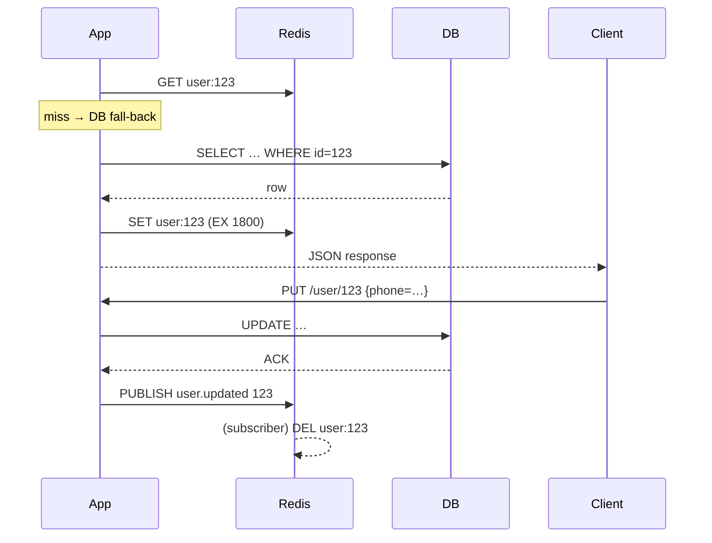

## 사용자 정보 캐싱에 대한 고찰

> **핵심 질문**
> “사용자 정보를 캐시에 두면 얼마나 빠르고 편하냐?” 보다는
> “**무엇을** 언제까지 어디에 어떤 규칙으로\*\* 캐싱해야 안전‧일관‧확장성을 얻을 수 있을까?”가 되어야 한다.

---

### 1. 캐싱이 정말 필요한가?

| 필요성                | 이점                                | 놓치기 쉬운 대가                                 |
| ------------------ | --------------------------------- | ----------------------------------------- |
| **지연(latency) 감소** | 로그인·프로필 조회 시 DB round-trip 제거     | 캐시 미스 시 되레 복잡도 증가                         |
| **DB 부하 완화**       | 트래픽 피크에서도 read replica 줄일 수 있음    | 캐시 무효화가 안 되면 “저장·조회 불일치” 폭증               |
| **퍼스널라이제이션**       | 페이지·추천 모델이 다층 캐시된 사용자 컨텍스트를 즉시 사용 | 너무 세분화한 키는 캐시 파편화(cache fragmentation) 야기 |

---

### 2. 어떤 사용자 데이터를 캐싱할까?

| 분류                               | 특징                      | 캐싱 적합성                                |
| -------------------------------- | ----------------------- | ------------------------------------- |
| **정적 프로필** (이름, 가입일, 기본 선호 언어 등) | 하루에 한 번도 안 바뀜           | ✔ TTL 1h\~24h도 무방                     |
| **세션 컨텍스트** (최근 본 상품, 장바구니)      | 짧은 기간 집중 변경             | ✔ 세션 키 기반 캐시 + 짧은 TTL                 |
| **권한/역할** (feature flag, 조직 권한)  | 변경 빈도 낮지만, 변경 즉시 반영 필요  | △ TTL 짧게 + Pub/Sub 무효화                |
| **실시간 지표** (잔액, 게임 코인)           | write 후 즉시 read 일관성이 필요 | ✘ 캐시 대신 ① DB ② CQRS/Event-Sourcing 고려 |

---

### 3. 전략별 비교

| 전략                      | 읽기 경로                     | 쓰기 경로                   | 장점            | 주의점                    |
| ----------------------- | ------------------------- | ----------------------- | ------------- | ---------------------- |
| **Read-Through**        | Cache → miss 시 DB → 캐시 적재 | DB 직접                   | 코드 단순, 높은 hit | “N+1 쓰기” 시 캐시 갱신 잊기 쉬움 |
| **Write-Through**       | Cache ← DB 동시             | 애플리케이션이 캐시에 먼저 쓰고 DB 일괄 | 일관성 ↑         | 쓰기 지연 비용, 장애 경로 2배     |
| **Write-Behind(Async)** | Cache 우선                  | 비동기 worker가 DB 반영       | 쓰기 폭주에 강함     | 장애 시 데이터 유실·재처리 난이도    |
| **Cache-Aside (Lazy)**  | 애플리케이션이 직접 캐시 미스 처리       | DB 먼저 → 캐시 삭제           | 제어 자유도, 단순    | 두 단계 요청 코드 중복          |

> **TIP** : 사용자 정보는 대부분 *Cache-Aside + TTL + Pub/Sub 무효화* 조합이 무난하다. DB → 캐시 일관성이 가장 직관적이고, 장애 시 Fallback(미스 → DB) 경로가 명확하기 때문이다.

---

### 4. 무효화(Invalidation)는 언제, 어떻게?

1. **TTL(Time-to-Live)**

   * 정적·준정적 데이터: 수 분\~수 시간.
   * “전화번호/이메일”처럼 즉시성 필수 항목은 0 \~ 수초.
2. **이벤트 기반**

   * 프로필 수정·권한 변경 트랜잭션 commit 후 → `publish 'user:123 updated'`
   * 캐시 서버들은 `SUBSCRIBE` 로 삭제/업데이트.
3. **소프트 만료 + 백그라운드 리프레시**

   * 응답은 stale 데이터를 즉시 주되, 백그라운드에서 새로 받아와 갱신(Stripe, Reddit 패턴).
4. **버전 키**

   * `user:123:v42` 처럼 버전이 바뀌면 자연히 미스.
   * 다중 캐시 레이어(에지 → 지역 POP → 중앙)에서 일관성 확보에 효율적.

---

### 5. 보안·프라이버시

| 체크리스트                     | 이유                                                     |
| ------------------------- | ------------------------------------------------------ |
| **PII 암호화**(적어도 at-rest)  | 캐시 메모리 dump·코어 파일 유출 대비                                |
| **메모리 격리** (multi-tenant) | 같은 Redis 인스턴스 안에서 키 스캔 방지                              |
| **GDPR/CCPA 삭제권**         | “캐시까지 지워야 완전 삭제” — `DELETE user:*` or key-version bump |
| **HTTP 헤더 캐시** 주의         | 프론트단에서 `Cache-Control: private` 반드시 지정                 |

---

### 6. 마이크로서비스 환경

* **각 서비스별 로컬 캐시(Guava/Caffeine) + 공유 Redis Cluster**
  “2계층” 구조가 가장 흔함. 로컬 L1으로 p99 latency ↓, Redis L2로 글로벌 일관성.
* **JWT Access Token만으로 기본 프로필 해결**
  *stateless* 접근. 단, 토큰 크기·회수 난이도 고려.
* **Service Mesh + Sidecar Cache (e.g., Envoy, Varnish)**
  요청 수가 기하급수적으로 늘고, 캐시 패턴을 팀에서 통일하고 싶을 때.

---

### 7. 관측·운영

1. **Hit/Miss Ratio** — “30 % 미만이면 캐시 위치 또는 TTL 재설계” 신호.
2. **Hot Key 탐지** — `INFO keyspace`(Redis)나 `slowlog get`.
3. **추가 지연 측정** — A/B 로 캐시 bypass 슬라이스를 두고 실제 체감 차이 확인.
4. **Red/Black 배포** — 임베딩 모델 교체처럼 캐시 포맷이 바뀔 때 필수.

---

### 8. 실전 예시: **Redis + Pub/Sub**

* **TTL 1800 s** + **Pub/Sub**로 “수정 즉시” 무효화.
* 컬럼 내용이 바뀌어도 TTL 만료 전이라면 이 이벤트로 깔끔히 삭제.

---

### 9. 체크리스트 요약

| ✔ 해야 할 것                         | ✘ 하면 안 되는 것                 |
| -------------------------------- | --------------------------- |
| 데이터 성격(정적/동적/민감도) 먼저 분류          | “일단 다 Redis 넣자” 식 만능 캐시     |
| TTL + 무효화 경로를 함께 설계              | 삭제 이벤트 빠뜨려 stale 데이터 방치     |
| 히트율·지연 메트릭으로 효과 검증               | 효과 확인 없이 캐시 계층만 추가          |
| PII·GDPR 규정 반영                   | 캐시에 평문 민감정보 장기 보관           |
| 복구/고가용성(Replication, AOF/RDB) 구성 | 싱글노드 Redis - 장애 → 전체 로그인 실패 |

---

## 결론

사용자 정보 캐싱은 \*\*“속도를 얻되, 일관성·보안·운영 복잡도와 맞바꾼다”\*\*는 교환이다.
성격별 데이터를 구분하고 **TTL + 이벤트 무효화 + 계층 캐시** 원칙을 지키면, 대규모 트래픽에서도 안전하게  p95 응답 시간을 줄일 수 있다. 반대로 **무분별한 캐싱은 데이터 동기화 지옥**을 만든다.

> 결국 캐시는 *“Optimization”* 이므로 **먼저 측정**, 이후 **최소한의 정책으로 단계적 도입**하는 것이 최선이다. 🎯
